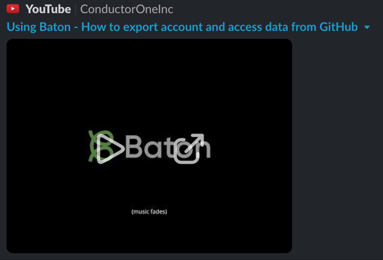

# Baton: A toolkit for auditing infrastructure access

The Baton toolkit gives developers the ability to extract, normalize, and interact with workforce identity data such as user accounts, permissions, roles, groups, resources, and more. Through the Baton CLI, developers can audit infrastructure access on-demand, run diffs, and extract access data. This can be used for automating user access reviews, exports into SIEMs, real-time visibility, and many other use cases.

Baton is structured as a toolkit of related command line tools. For each data source there is a "connector", such as `baton-github` for interacting with GitHub's API. This tool exports data in a format that the `baton` tool can understand, transform, and use to perform operations on the application

## :tada: :tada: Launching Baton as an Open Source Project!
- [Announcing Baton, an Open Source Toolkit for Auditing Infrastructure User Access](https://www.conductorone.com/blog/announcing-baton-open-source-for-auditing-infrastructure-access/)
- [Technical Deep Dive: Using Baton to Audit Infrastructure Access](https://www.conductorone.com/blog/technical-deep-dive-using-baton-to-audit-infrastructure-access/)
- [Baton and the Journey to Identity Security and Unified Access Control](https://www.conductorone.com/blog/baton-journey-to-identity-security-and-unified-access/)


# What can you do with Baton?

As a generic toolkit for auditing access, Baton can be used for many use cases, such as:

 - [Export GitHub access updates to a CSV file using Baton](https://www.conductorone.com/docs/baton/github_integration/)
 - [Use Baton to get Splunk alerts when a new Github admin is added](https://www.conductorone.com/docs/baton/siem_integration/)
 - [Set up a daily check for GitHub user rights updates using Baton](https://www.conductorone.com/docs/baton/github_action_schedule/)
 - [Diff access rights from two SaaS systems with Baton](https://www.conductorone.com/docs/baton/saas_integration/)
- Finding all AWS IAM Users with a specific IAM Role
- Auditing Github Repo Admins
- Finding users in apps that aren't in your IdP
- Detecting differences or changes in permissions in GitHub or AWS
- Discovering all access for an user or account across all SaaS and IaaS systems
- Calculating the effective access of a user based on group membership

These are just a few of the use cases that Baton can be leveraged for.

# Trying it out: Find all GitHub repo admins

Baton can installed via Homebrew:

```
brew install conductorone/baton/baton conductorone/baton/baton-github
```

Once installed, you can audit GitHub access with the following:

```
# Run the baton github connector
baton-github 
# Output the resources discovered
baton resources
# Output the same data to JSON and parse it with jq
baton resources -o json | jq '.resources[].resource.displayName'
```

We have also recorded a short video exploring some of the data Baton can extract from Github:
[](http://www.youtube.com/watch?v=mgoPNvIc1U8 "VIDEO: Using Baton - How to export account and access data from GitHub")

# What connectors exist in Baton today?

We're releasing five initial connectors with the open source launch of Baton. The ConductorOne team has dozens of more connectors written in our precursor proprietary project from before Baton, and is aggressively porting them to the Baton ecosystem.

Additionally, making a new connector is really easy -- we wrap up many complexities in the SDK, letting a connector developer focus on translating to the Baton data model.

- [baton-1password](https://github.com/ConductorOne/baton-1password)
- [baton-aws](https://github.com/ConductorOne/baton-aws)
- [baton-asana](https://github.com/ConductorOne/baton-asana)
- [baton-bitbucket](https://github.com/ConductorOne/baton-bitbucket)
- [baton-box](https://github.com/ConductorOne/baton-box)
- [baton-cloudamqp](https://github.com/ConductorOne/baton-cloudamqp)
- [baton-duo](https://github.com/ConductorOne/baton-duo)
- [baton-expensify](https://github.com/ConductorOne/baton-expensify)
- [baton-github](https://github.com/ConductorOne/baton-github)
- [baton-google-identity-platform](https://github.com/ConductorOne/baton-google-identity-platform)
- [baton-jamf](https://github.com/ConductorOne/baton-jamf)
- [baton-jumpcloud](https://github.com/ConductorOne/baton-jumpcloud)
- [baton-linear](https://github.com/ConductorOne/baton-linear)
- [baton-sql-server](https://github.com/ConductorOne/baton-sql-server)
- [baton-mysql](https://github.com/ConductorOne/baton-mysql)
- [baton-notion](https://github.com/ConductorOne/baton-notion)
- [baton-okta](https://github.com/ConductorOne/baton-okta)
- [baton-pagerduty](https://github.com/ConductorOne/baton-pagerduty)
- [baton-panther](https://github.com/ConductorOne/baton-panther)
- [baton-postgresql](https://github.com/ConductorOne/baton-postgresql)
- [baton-retool](https://github.com/ConductorOne/baton-retool)
- [baton-slack](https://github.com/ConductorOne/baton-slack)
- [baton-splunk](https://github.com/ConductorOne/baton-splunk)
- [baton-tableau](https://github.com/ConductorOne/baton-tableau)
- [baton-zoom](https://github.com/ConductorOne/baton-zoom)

# Learn more about Baton

The [Baton documentation site contains more documentation and example use cases](https://www.conductorone.com/docs/baton/intro/).

# Contributing, support and issues

We started Baton because we were tired of taking screenshots and manually building spreadsheets.  We welcome contributions, and ideas, no matter how small -- our goal is to make identity and permissions sprawl less painful for everyone.  If you have questions, problems, or ideas: Please open a Github Issue!

See [CONTRIBUTING.md](./CONTRIBUTING.md) for more details.

# `baton` command line usage

```
baton is a utility for working with the output of a baton-based connector

Usage:
  baton [command]

Available Commands:
  access         List effective access for a user
  completion     Generate the autocompletion script for the specified shell
  diff           Perform a diff between sync runs
  entitlements   List entitlements
  export         Export data from the C1Z for upload
  grants         List grants
  help           Help about any command
  principals     List principals
  resource-types List resource types for the latest (or current) sync
  resources      List resources for the latest sync
  stats          Simple stats about the c1z

Flags:
  -f, --file string            The path to the c1z file to work with. (default "sync.c1z")
  -h, --help                   help for baton
  -o, --output-format string   The format to output results in: (console, json) (default "console")
  -v, --version                version for baton

Use "baton [command] --help" for more information about a command.
```
